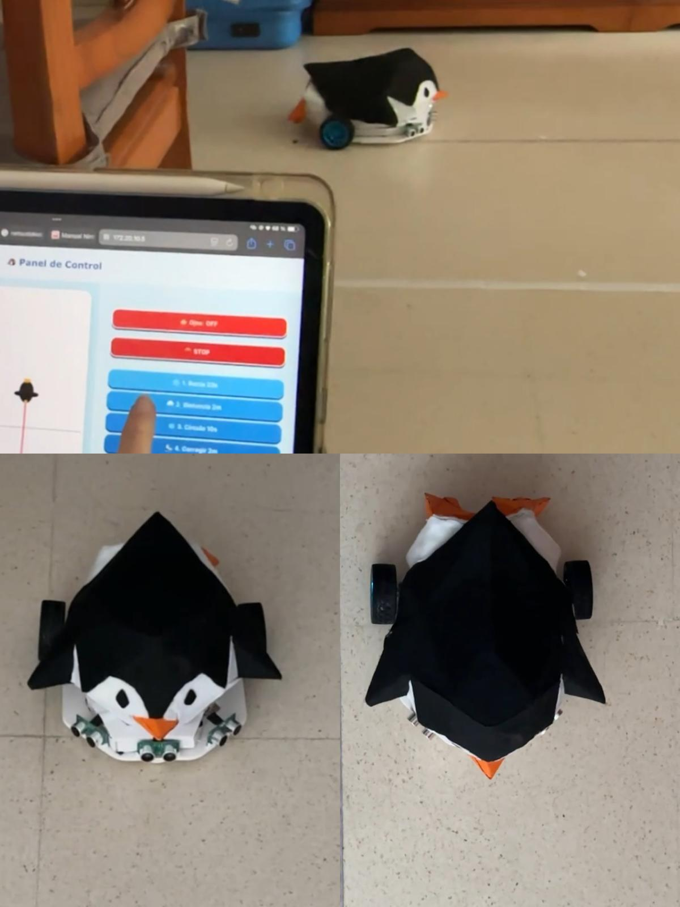
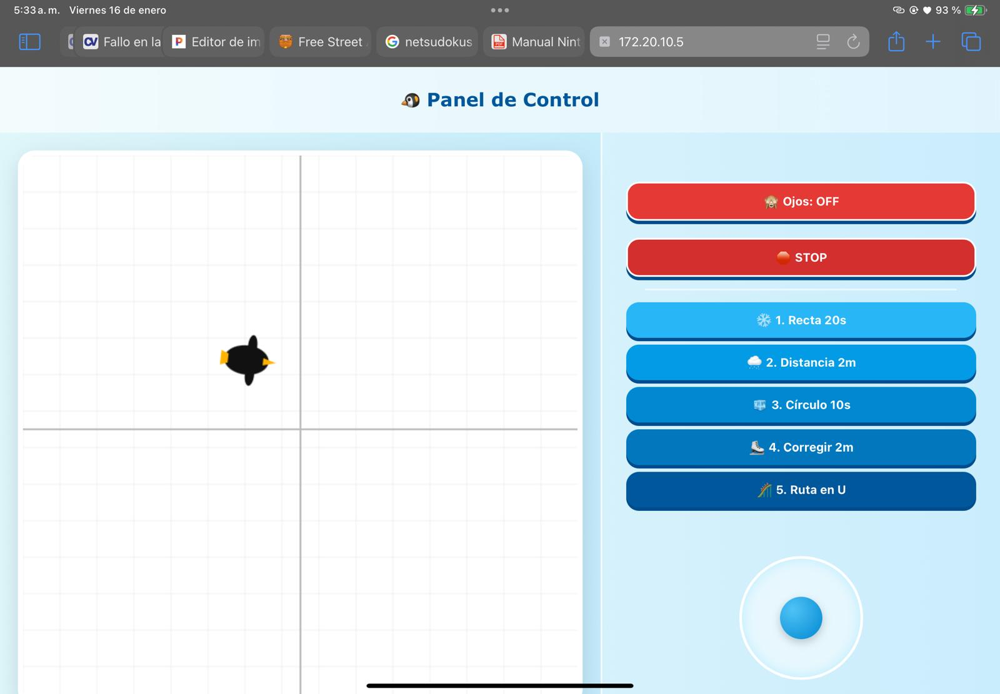

# 🐧 Pingüino: Arquitectura y Control de Robot Diferencial con ESP32 y Micro-ROS


> [!NOTE]
> Este proyecto forma parte de la asignatura Laboratorio de Robótica del Grado de Ingeniería Electrónica, Robótica y Mecatrónica (Universidad de Málaga). 

## 🚀 Descripción del Proyecto

Diseño y desarrollo integral de un robot móvil de tracción diferencial basado en el microcontrolador **ESP32**. El sistema evoluciona desde el control de motores a bajo nivel (PID) y estimación de pose por odometría, hasta la navegación autónoma ininterrumpida coordinada por una máquina de estados. Además, culmina con la integración de telemetría en **ROS 2** (vía Micro-ROS) y el pilotaje remoto interactivo mediante un servidor web embebido.

<div align="center">
  
</div>

---

## ⚙️ Arquitectura de Hardware y Conexiones

El sistema físico se fundamenta en los siguientes componentes y parámetros de diseño:

* **Microcontrolador:** ESP32 
* **Potencia y Actuadores:** Driver L298N + 2x Motores DC (PWM 1000 Hz, 10-bit)
* **Odometría:** Encoders magnéticos de cuadratura (**1500 pulsos/vuelta**)
* **Sensores Reactivos:** 3x US-016 (Analógicos) para detección de obstáculos
* **Cinemática Base:** Radio de rueda: **0.0335 m** | Distancia entre ruedas: **0.2175 m**

### Asignación de Pines y Conexionado

**Tabla 1: Interfaces de Potencia y Odometría (Motores)**

| Elemento | Señal de Control | Motor 1 (Derecho) | Motor 2 (Izquierdo) |
| :--- | :--- | :---: | :---: |
| **Driver L298N** | PWM (Fase A) | `PIN 32` | `PIN 19` |
| | PWM (Fase B) | `PIN 33` | `PIN 18` |
| **Encoders** | Interrupción (Canal A) | `PIN 25` | `PIN 27` |
| | Interrupción (Canal B) | `PIN 26` | `PIN 14` |

**Tabla 2: Sistema de Percepción y Obstáculos (US-016)**

| Dispositivo | Ubicación Relativa | Pin de Lectura ADC (ESP32) |
| :--- | :--- | :---: |
| **Sensor 1** | Lateral Derecho | `PIN 34` |
| **Sensor 2** | Frontal / Centro | `PIN 35` |
| **Sensor 3** | Lateral Izquierdo | `PIN 39` |

**Tabla 3: Referencias Comunes y Alimentación**

| Tipo de Conexión | Origen de la Señal | Destino en el Sistema |
| :--- | :--- | :--- |
| **Tierra Común (GND)** | Pines GND del ESP32 | GND (Driver L298N, Encoders y Sensores) |
| **Potencia Motores** | Batería principal | Entrada de Potencia (12V) Driver L298N |
| **Lógica** | Salida 5V (Driver / BEC) | Entrada VIN (ESP32) |

---

## 📂 Estructura de Tareas y Desarrollo del Software

El repositorio está organizado en tres módulos de código principales que agrupan las 8 fases del proyecto, evitando la necesidad de reprogramar la placa constantemente. 

> [!NOTE]
> El desarrollo teórico, los diagramas de flujo y la justificación detallada de cada tarea individual (de la 1 a la 8) se encuentran explicados exhaustivamente en la memoria técnica: **[Documentos_Proyecto.pdf](./Documentos_Proyecto.pdf)**.

### `tareas123456.ino`: Navegación Autónoma y Control (Tareas 1 a 6)
*   **Objetivo:** Integrar el control PID y el seguimiento de trayectorias en una única máquina de estados principal.
*   **Guiado de Precisión:** Ejecución secuencial de movimientos rectilíneos, trazado de circunferencias y rutas complejas (trayectoria en "U").
*   **Seguridad Reactiva:** Lógica de interrupción basada en los sensores analógicos. Bloquea el avance ante obstáculos y recupera el tiempo exacto de la misión una vez se despeja el camino.

### `tarea7.ino`: Integración Micro-ROS y ROS 2 (Tarea 7)
*   **Objetivo:** Conectar el ESP32 mediante Wi-Fi (UDP) con un entorno distribuido ROS 2 Humble.
*   **Telemetría y Control Híbrido:** Publicación de la pose en `/odom`. Si se detecta un comando manual en el tópico `/cmd_vel`, el sistema aborta automáticamente la misión autónoma para acatar el control remoto humano.

### `tarea8.ino`: Estación de Control Embebida Web (Tarea 8)
*   **Objetivo:** Desplegar un servidor HTTP autónomo en el ESP32 que proporciona una interfaz gráfica remota (Dashboard) sin depender de red externa, utilizando peticiones JSON.
*   **Teleoperación Interactiva:** Selección de misiones al vuelo, activación/desactivación de la evasión de obstáculos y pilotaje directo mediante un *joystick* táctil/virtual.
*   **Monitorización en Tiempo Real:** Incorpora un *canvas* 2D que dibuja de forma simultánea la trayectoria teórica del robot frente a la posición real estimada por la odometría.

<br>
<div align="center">
  
</div>
<br>

---

### 🎥 Demostraciones en Vídeo

El comportamiento del sistema superando las misiones autónomas, reaccionando a los obstáculos físicos y respondiendo a los comandos remotos está documentado en vídeo:

> [!TIP]
> 🔗 **[Ver lista de reproducción completa (Google Drive)](https://drive.google.com/drive/folders/1L5iLRtOvO2SgiwMw8RrxLdU0G_z7GuCU?usp=drive_link)**
---

---

## 💻 Despliegue de Entorno Micro-ROS (WSL2 / Ubuntu)

Para operar la **Tarea 7** y replicar la integración con el ecosistema ROS 2 Humble, ejecuta la siguiente secuencia de comandos asegurando que la máquina virtual (Agente) y el ESP32 se encuentran en la misma subred Wi-Fi.

**1. Inicializar el Agente de Comunicación UDP:**
```bash
ros2 run micro_ros_agent micro_ros_agent udp4 --port 8888 -v6
```

**2. Monitorización Limpia de Odometría:**
*(Se emplea el flag `--no-daemon` para evitar colapsos del proceso en segundo plano de ROS 2 al operar bajo redes virtuales).*
```bash
ros2 topic echo /odom nav_msgs/msg/Odometry --field pose.pose --no-daemon
```

**3. Interrupción Manual (Override en /cmd_vel):**
*(Se publica en ráfaga continua a 10 Hz para garantizar la recepción del comando y mitigar la pérdida de paquetes derivada de la conexión Wi-Fi).*
```bash
ros2 topic pub -r 10 /cmd_vel geometry_msgs/msg/Twist "{linear: {x: 0.0, y: 0.0, z: 0.0}, angular: {x: 0.0, y: 0.0, z: 0.5}}"
```

> [!WARNING]
> **Troubleshooting de Red (Windows WSL2):** 
> Si la terminal se queda congelada al intentar descubrir nodos o ejecutar `ros2 topic list`, **no reinicies la máquina**. Ejecuta directamente `ros2 daemon stop` para purgar y reiniciar la tubería de red DDS.
